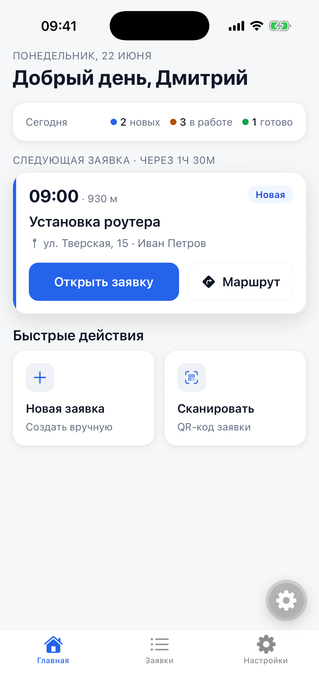
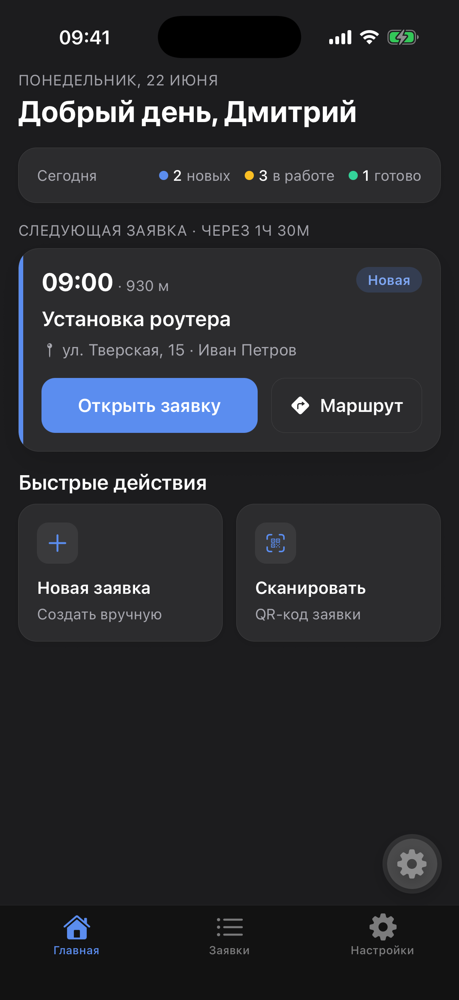
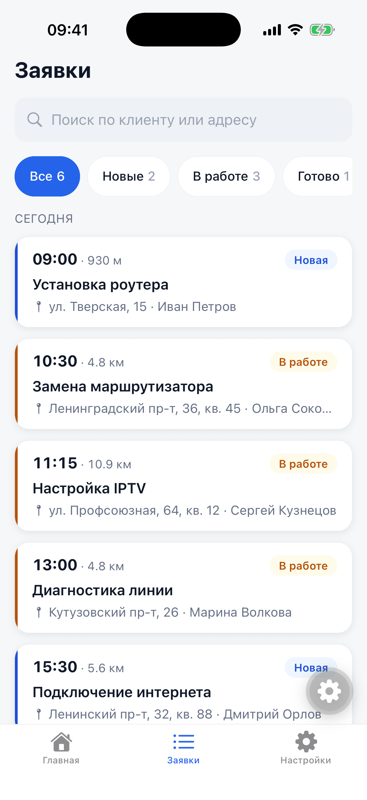
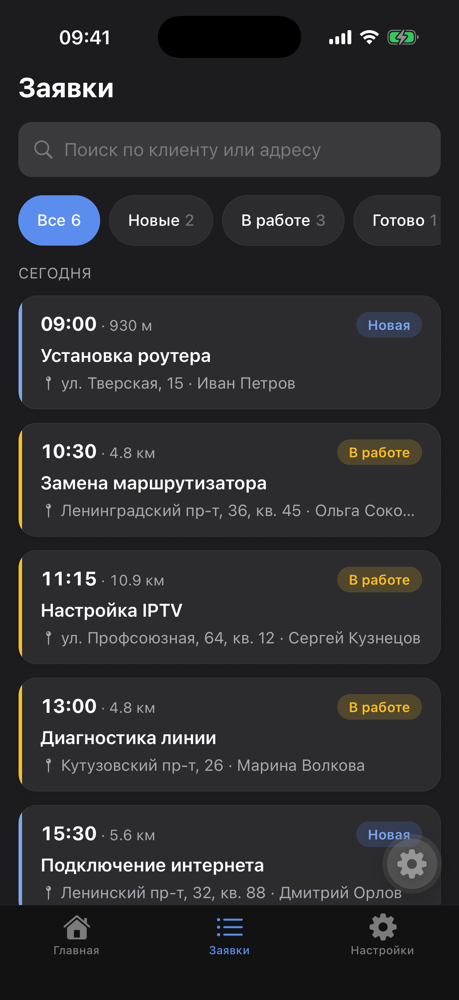
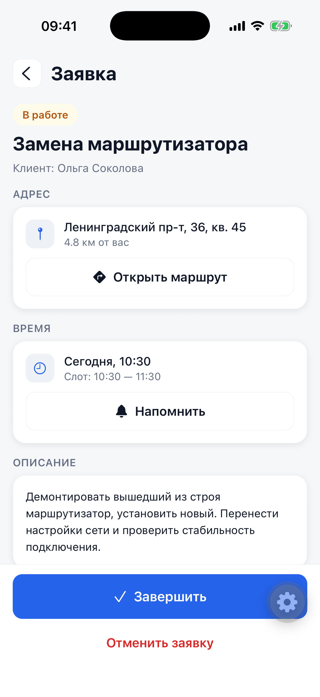
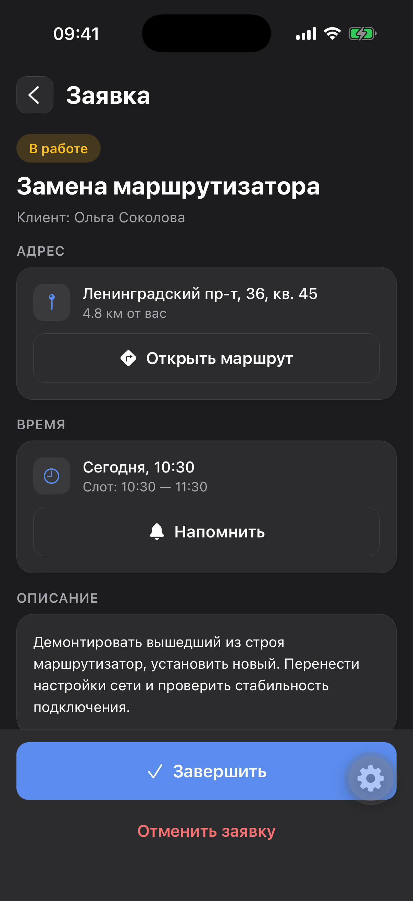
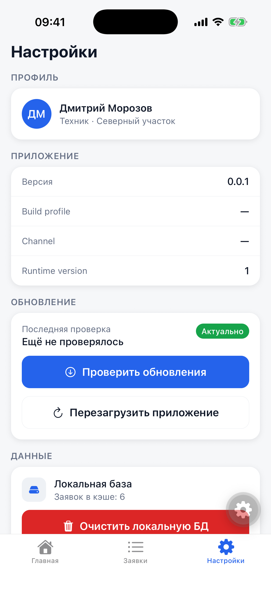
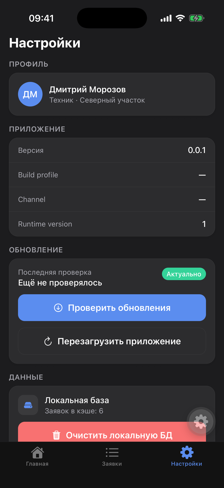
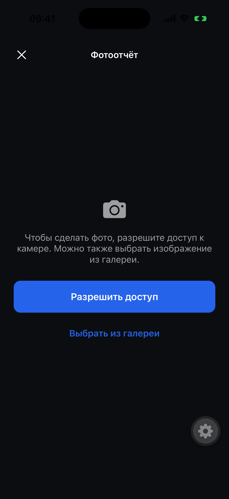

# Onsite

[](https://github.com/ZaycevDmitriy/field-service-crm/actions/workflows/ci.yml)

**English** · [Русский](README.ru.md)

Onsite is a mobile mini-CRM for on-site field-service technicians (router installs, line
diagnostics, cable repair). It is a portfolio project built with Expo and React Native, focused on
offline-first behavior, native device APIs, and a clean feature-based architecture.

## Overview

A technician opens the app to their nearest active job, works through a list of service orders
(search, filter by status), opens an order to follow its status flow (New → In Progress →
Done / Cancelled), attaches a photo report, builds a route in external maps, and sets visit
reminders. All data is stored locally in SQLite, so the app works without a network connection. App
delivery is split into two channels: **native** (EAS Build) and **JS/asset** (EAS Update OTA).

## What this project demonstrates

- Expo Router file-based navigation
- Expo Development Build
- EAS Build profiles
- EAS Update OTA flow
- SQLite local persistence
- Native permissions
- Camera and photo report flow
- Location and external maps
- Local notifications
- Feature-based architecture
- Reusable React Native UI components
- Light and dark theme driven by the system color scheme
- Loading, empty, error, and offline states

## Demo

There is no hosted demo — run the app locally on a development build (see
[Getting Started](#getting-started)). The screenshots below were captured on the iOS simulator.

Live OTA demo: **Settings → Update** shows the channel / runtime version and the
"Check for updates" / "Reload" actions; publish an `eas update` and watch it land on an already
installed build (see [EAS Update Demo](#eas-update-demo)).

## Screenshots

> iOS simulator, Moscow location set for the geo features. Light and dark follow the system
> appearance.

| Screen | Light | Dark |
|--------|-------|------|
| Dashboard |  |  |
| Orders |  |  |
| Order details |  |  |
| Settings |  |  |

Photo report flow — camera permission gate with a gallery fallback. The capture screen is
intentionally dark in both themes:



## Features

- **Dashboard** — greeting, today's summary (new / in progress / done) and the nearest active order
  by straight-line distance.
- **Orders list** — virtualized list (FlashList) with case-insensitive search by client or address
  and status filter chips.
- **Order details** — status flow (New → In Progress → Done / Cancelled), client, address, time
  slot and description.
- **Photo report** — attach photos to an order from the camera or the gallery, behind a permission
  gate.
- **Location & route** — straight-line distance to each order; "Open route" hands off to the system
  maps app.
- **Reminders** — a local notification for the visit time.
- **Offline-first** — orders and photos persist in SQLite; an offline banner and error / empty
  states are handled.
- **OTA updates** — EAS Update gated by a fingerprint runtime version.
- **Theming** — light and dark themes follow the OS color scheme.

## Tech Stack

- **Runtime:** Expo SDK 56, React Native 0.85, React 19 (Hermes, New Architecture)
- **Language:** TypeScript 6 (`strict`, no `any`)
- **Navigation:** Expo Router (typed routes, React Compiler)
- **State:** Zustand (long-lived state only)
- **Persistence:** expo-sqlite
- **Native APIs:** expo-camera, expo-image-picker, expo-location, expo-notifications, expo-updates
- **UI / animation:** custom UI kit, react-native-reanimated, @shopify/flash-list,
  @react-native-vector-icons/material-icons
- **Tooling:** ESLint 9 (+ SonarJS), Prettier, jest-expo (unit tests)

## Architecture

Feature-Sliced Design (FSD-lite) on top of Expo Router. Imports flow strictly downward:

```
app → pages → features → entities → shared
```

- **app** — Expo Router route files (thin) plus the root layout (providers, DB init, status bar).
- **pages** — one slice per screen; composes features and entities.
- **features** — user actions: `order-search`, `order-filter`, `order-status`, `photo-capture`,
  `order-reminder`, `open-route`, `app-updates`.
- **entities** — the `order` business entity (`model` / `api` / `ui`). Photos are part of the order
  aggregate, not a separate entity.
- **shared** — project-agnostic UI kit, theme tokens and libs (`date`, `geo`, `location`,
  `notifications`, `db`, `invariant`).

Rules: a slice imports only from layers strictly below it; slices in the same layer never import
each other; a slice is consumed only through its public API (`index.ts`). Native APIs and
persistence live in services (`entities/*/api`, `shared/lib`); UI and the store never call them
directly. Long-lived state lives in Zustand; transient screen state stays local.

## Project Structure

```
src/
  app/                  # Expo Router routes (thin) + root layout
    (tabs)/             #   dashboard, orders, settings
    orders/[orderId]    #   order details
    camera/[orderId]    #   photo capture
  pages/                # dashboard, orders, order-details, photo, settings
  features/             # order-search, order-filter, order-status, photo-capture,
                        # order-reminder, open-route, app-updates
  entities/
    order/              # model (types, store, getNearestOrder), api, ui
  shared/
    config/theme        # color / spacing / radius / typography tokens
    ui/                 # business-agnostic UI kit
    lib/                # date, geo, location, notifications, db, invariant
    model/              # app-wide store (offline, location, update checks)
```

## Getting Started

Prerequisites: Node 20+, npm, Xcode (iOS simulator) or Android Studio (emulator), and a
**development build** of the app. This project uses native modules, so Expo Go is not supported —
see [Development Build](#development-build).

```bash
npm install        # install dependencies
npm start          # start Metro for the dev client (expo start --dev-client)
npm run ios        # open on the iOS simulator
npm run android    # open on an Android emulator
```

Quality gates:

```bash
npm run check      # lint + typecheck + format:check
npm test           # unit tests (jest-expo)
```

## Development Build

`expo-dev-client` provides a custom dev client (a replacement for Expo Go that supports the
project's native modules — camera, SQLite, location, notifications, `expo-updates`). Build and run:

```bash
eas build --profile development --platform android
npm start
```

Install the resulting `.apk` on a device / emulator, then connect to Metro from the dev client.

> The `eas` commands require an Expo account (`eas login`) and the CLI installed globally:
> `npm i -g eas-cli`.

## EAS Build

Profiles are defined in [`eas.json`](eas.json):

| Profile | Purpose | Distribution | Channel |
|---------|---------|--------------|---------|
| `development` | dev client with Metro | internal | development |
| `preview` | internal demo without Metro (release JS) | internal | preview |
| `production` | store build (version from the release pipeline) | store | production |

```bash
eas build --profile development --platform android
eas build --profile preview --platform android
eas build --profile production --platform android
```

iOS builds are optional (they require an Apple Developer account) — add `--platform ios`.

Before the first build, link the project to EAS and configure updates (this fills `extra.eas.projectId`
and `updates.url` in [`app.config.ts`](app.config.ts)):

```bash
eas init
eas update:configure
```

## EAS Update Demo

Publish a JS/asset update to a channel — it reaches builds with the same `runtimeVersion`:

```bash
eas update --channel preview --message "Tweak the settings screen copy"
```

On the device, **Settings → Update** shows the channel / runtime version and the
"Check for updates" / "Reload" actions: "Check" downloads an available update, "Reload" applies it.
OTA is disabled in development mode — the screen shows "Unavailable in dev" and does not crash.

**Native vs JS boundary:**

| What changed | How it ships |
|--------------|--------------|
| Native code and packages (`expo-camera`, `expo-updates`, permissions, icons / splash, SDK version) | A new **EAS Build** (OTA cannot help) |
| Only JS / TS and assets (logic, UI, copy, images) | An **EAS Update** (OTA) |

`runtimeVersion` in [`app.config.ts`](app.config.ts) uses the `fingerprint` policy: Expo computes a
fingerprint of the native layer (`@expo/fingerprint`) and stamps both the build and the update with
it. An update whose fingerprint is incompatible (the native layer changed) will not apply to an old
binary — that is the automatic native-vs-JS boundary.

## Releases

Versioning and release notes are automated with [semantic-release](https://semantic-release.gitbook.io/)
from [Conventional Commits](https://www.conventionalcommits.org/): the version is an *output* derived
from the commits since the last release, not set by hand.

Releasing is a manual gate — open a pull request from `main` into the `release` branch. Merging it runs
the [release pipeline](.github/workflows/release-android.yml) on GitHub Actions, which:

1. runs the quality gate (lint, typecheck, format, tests),
2. computes the next version from the commit history,
3. builds the Android APK on the runner (native Gradle, no EAS credentials) stamped with that version,
4. publishes a [GitHub Release](../../releases) with the APK and its `runtimeVersion` fingerprint,
5. updates [`CHANGELOG.md`](CHANGELOG.md) and back-merges `release` into `main`.

Commit types drive the bump: `feat:` → minor, `fix:` / `perf:` → patch, `feat!:` or a `BREAKING CHANGE:`
footer → major; `chore:` / `docs:` / `ci:` do not trigger a release. Commit messages use an English type
with a Russian description.

### Delivery channels

| What changed | How it ships |
|--------------|--------------|
| Native code or packages (SDK, permissions, native modules, icons) | A new **APK release** via the pipeline above |
| Only JS / TS and assets | An **EAS Update** (OTA) on the `production` channel |

OTA is gated by the `fingerprint` runtime version, so a JS update only lands on a build whose native
fingerprint matches (see [EAS Update Demo](#eas-update-demo)).

## Design Source

The UI was implemented from a design prototype handoff (screens, spacing and color tokens). The
prototype lives in `design/` and is kept out of the repository — it is reference material, not app
source. Deviations from the prototype are documented in the project's PDR.

## Design Decisions

- **FSD-lite over a flat structure** — explicit ownership and one-directional imports keep features
  isolated and testable.
- **Zustand for long-lived state only** — orders and app-wide flags live in stores; transient screen
  state stays local component state.
- **A custom UI kit instead of a component library** — demonstrates React Native UI fundamentals and
  keeps the dependency surface small.
- **System-driven theme** — light / dark follow the OS appearance; no manual in-app toggle in the
  MVP.
- **FlashList v2 for the orders list** — virtualization for large lists; `maintainVisibleContentPosition`
  is disabled when the data set is fully replaced on filter / search so the list does not jump.
- **Fingerprint runtime version** — an EAS Update only lands on builds with a compatible native
  fingerprint, which enforces the native-vs-JS boundary automatically.

## Trade-offs

- No backend in MVP: SQLite was chosen to focus on offline-first mobile behavior and Expo native
  APIs.
- No authentication: the project focuses on field-service workflow, not account management.
- No full map screen: external maps are enough for MVP and reduce scope.
- No UI library: custom components demonstrate React Native UI fundamentals.
- Theme: light and dark are both implemented and follow the OS appearance; a manual in-app theme
  switch (light / dark / system) is intentionally left as future work.
- No separate Android UI: the React Native implementation uses one shared UI with platform-specific
  adjustments only where necessary.
- Local notifications only: push notifications require a backend and credentials, so they are future
  scope.

## Future Improvements

Documented but intentionally not implemented in the MVP:

- A backend with authentication and multi-device sync
- Push notifications (require a backend and credentials)
- A full in-app map screen
- A manual in-app theme switch (light / dark / system)

## License

[MIT](LICENSE) © 2026 Dmitriy Zaycev
